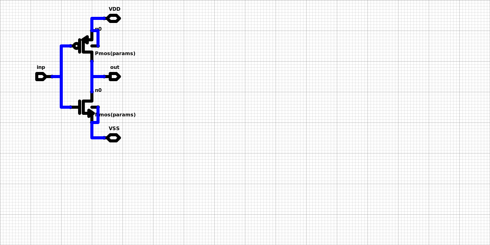

# Hdl21 Schematic Demos

Use this schematic -- 



-- yes that *is* the schematic - in some Hdl21 python generators & simulations.


## Installation & Usage

* Get the [Poetry](https://python-poetry.org/docs/) package manager for Python.
* `poetry install`
* `pytest --verbose` should produce something like: 

```
$ pytest --verbose
=== test session starts ===
platform darwin -- Python 3.10.8, pytest-7.1.2, pluggy-1.0.0 -- /.../bin/python
cachedir: .pytest_cache
rootdir: /.../Hdl21SchematicDemos
collected 1 item                                                                                                                         

tests/test_hdl21schematicdemos.py::test_serialize_vlsir PASSED                                                                     [100%]

=== 1 passed in 0.23s ===
```

* Add the `pytest -s` (show) option to see some terminal output.
